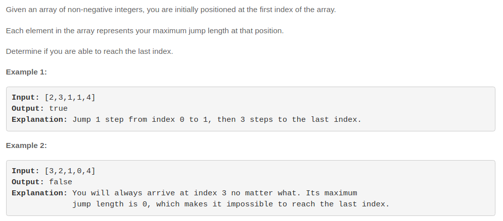

# Jump Game



一眼看过去，这题是一个可以分解成很多子问题的题，于是我的首选方法是递归。当然昨天想到了这题肯定要优化，不然时间复杂度很大。然后我写代码的时候没有什么思路，就想着写吧写吧，没想到写出来还真的可以解决问题。

## 递归(Time Limit Exceeded)

```javascript
/**
 * @param {number[]} nums
 * @return {boolean}
 */
var canJump = function(nums) {
    const flag = []
    function helper(arr, num, index) {
        if(num === 0 || flag[index] === 0) {
            flag[index] = 0
            return false
        }
        const len = arr.length
        if(len <= num) {
            return true
        }
        while(num--)  {
            if(helper(arr.slice(num + 1), arr[num], index + num + 1)) {
                return true
            } else {
                flag[num + 1 + index] = 0
            }
        }
        return false
    }
    if(nums.every(n=>n > 0)) {
        return true
    }
    if(nums[0] === 0) {
        if(nums.length === 1) {
            return true
        }
        return false
    }
        return helper(nums.slice(1), nums[0], 0)
};
```

## 贪心(accepted)

```javascript
/**
 * @param {number[]} nums
 * @return {boolean}
 */
var canJump = function(nums) {
    const len = nums.length
    let rightmost = 0
    for(let i = 0; i < len; ++i) {
        if(i <= rightmost) {
            rightmost = Math.max(rightmost, i + nums[i])
            if(rightmost >= len - 1) {
                return true
            }
        }
    }
    return false
};
```

